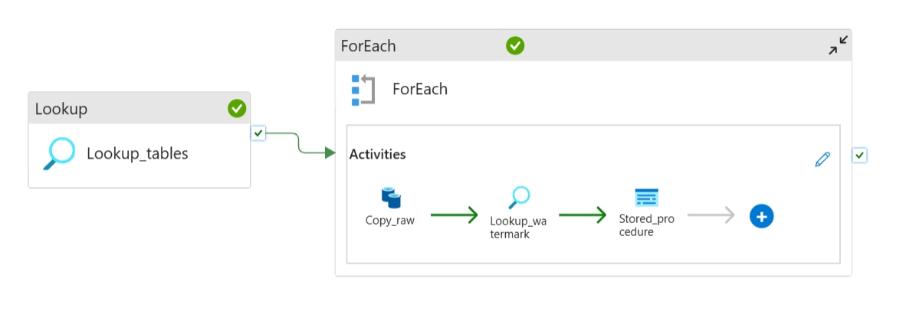

# DeltaFlow-OnPrem-to-Azure-ETE-Pipeline

An end-to-end, enterprise-grade data engineering pipeline that incrementally migrates transactional ERP data from an on-premises SQL Server to Azure Data Lake Storage Gen2 (ADLS Gen2) using a metadata-driven Azure Data Factory (ADF) framework. The data is transformed using Azure Databricks (PySpark, Auto Loader, and Unity Catalog) via the Medallion Architecture, and exposed via Azure Synapse Analytics for business intelligence.

This project orchestrates the ingestion, transformation, and optimization of relational data into high-performance, analytical Star Schemas ready for sub-second downstream reporting.

---

## System Architecture

The data platform transitions through an automated pipeline designed for incremental updates, minimal processing costs, and maximum query performance:

## Prerequisites & Environment Setup

### Prerequisites
- Active Azure Subscription.
- Intermediate/Advanced knowledge of PySpark (Auto Loader, Batch Structured Streaming, Delta Lake optimization).

### Resource Provisioning
Log in to the Azure Portal and provision the following services into a unified Resource Group:
* Azure Storage Account (ADLS Gen2) — *Enable **Hierarchical Namespace (HNS)** during creation.*
* Azure Data Factory (ADF)
* Azure Databricks Access Connector & Azure Databricks Workspace
* Azure Synapse Analytics Workspace

### Security & Governance (Unity Catalog & Access Control)
To allow Databricks Unity Catalog to securely govern your Data Lake without access keys, go to your Storage Account's **Access Control (IAM)** and assign the following roles to your Databricks Access Connector's Managed Identity:
* Storage Blob Data Contributor
* Storage Account Contributor
* EventGrid EventSubscription Contributor
* Storage Queue Data Contributor

Log into your Databricks Workspace as an Admin. In **Catalog Explorer**, create a new **Storage Credential** by pasting the Azure Resource ID of your Access Connector. Once connected, map your External Locations, Schemas, and Catalog structures.

## Getting Started - Setup

- Provision Azure Resources: Log in to the Azure Portal, create a Resource Group, and provision the following services:
  - Azure Storage Account
  - Azure Data Factory (ADF)
  - Key Vault
  - Azure Databricks Access Connector
  - Azure Databricks Workspace

- Configure the Data Lake: During the Storage Account setup, enable Hierarchical Namespace (HNS) to upgrade standard Blob storage into a true directory-based Data Lake (ADLS Gen2). Create your storage containers. To allow Unity Catalog to securely access the data lake, go to the Storage Account's Access Control (IAM) and assign the following roles to the Access Connector's Managed Identity:
  - Storage Blob Data Contributor
  - Storage Account Contributor
  - EventGrid EventSubscription Contributor
  - Storage Queue Data Contributor

- Configure Unity Catalog & Storage Credentials: Databricks strictly enforces a limit of one Unity Catalog metastore per region per account; all workspaces in the same region share this central metastore. Log into your Databricks workspace as a Metastore Admin or Account Admin. In the Catalog Explorer, create a new Storage Credential by pasting the Azure Resource ID of your Access Connector. Once connected, set up your external locations, schemas, and external tables pointing to the ADLS Gen2 data lake.

- Initialize Ingestion Pipeline - ADF: Launch Azure Data Factory and configure the integration runtime/linked services to connect to your on-premises database (see resources below). The ADF ingestion pipeline utilizes a programmatic approach to loop through target tables dynamically, track deltas, and log high-watermarks safely.

- Process Data: Once the ADF ingestion pipeline is successfully built and running, launch Azure Databricks to begin data transformation.
  
##### Bronze Layer (Raw Replication): 
An ingestion pipeline was created to dynamically auto load all source data from the source containers as they drop to the bronze layer. Databricks Auto Loader monitors cloud folders to discover new batches incrementally, appending raw entries seamlessly into schema-inferred Bronze Parquet tables.  

##### Silver Layer (Cleaning & Harmonization): 
The silver layer houses all transformations done to the tables. This startes with batch streaming of data, cleaning, standardizing of data types, reformating of column names, flattening of transactional constraints and finally saving as a delta table using the MERGE strategy to handle upserts smoothly, preventing data duplication for downstream analytics

##### Gold Layer (Analytical Star Schema): 
Gold layer serves as the final layer. Introduced denormalised tables by joining dim tables to produce flat tables ready for use downstream. To reconcile structural discrepancies within the AdventureWorks source data, total prices were re-calculated from sales detail rows. Finalized tables are then updated via idempotent multi-key Delta MERGE operations and Z-Ordered to guarantee fast, cost-efficient Synapse queries.

##### Final Pipeline was setup for all layers to run in parallel 

##### Serving Layer: 
Azure Synapse Serverless SQL Pools expose the optimized Gold Delta files as relational views, serving sub-second, highly cost-efficient aggregations straight to Power BI.

## Resources 
- https://learn.microsoft.com/en-us/azure/databricks/data-governance/unity-catalog/setup-uc
- https://learn.microsoft.com/en-us/azure/databricks/ingestion/cloud-object-storage/auto-loader/unity-catalog
- https://learn.microsoft.com/en-us/azure/databricks/tables/external

